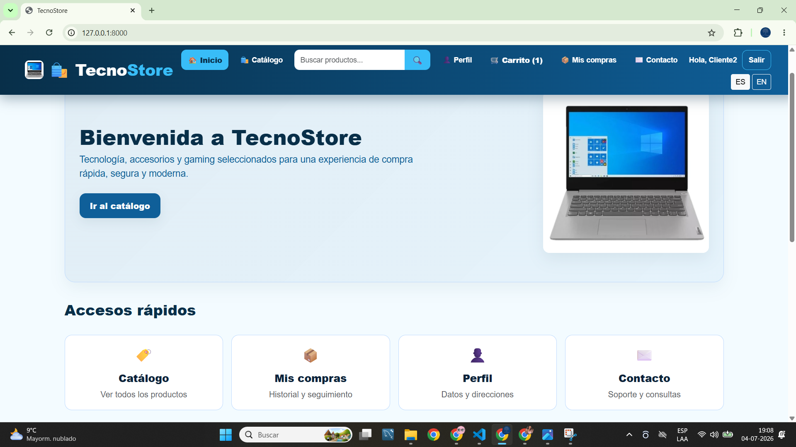
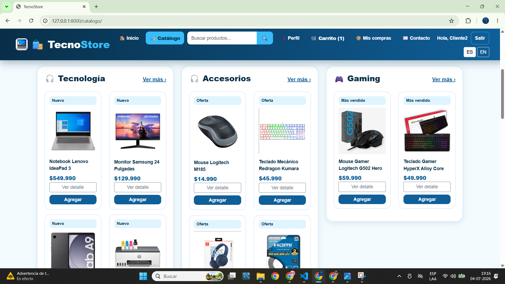
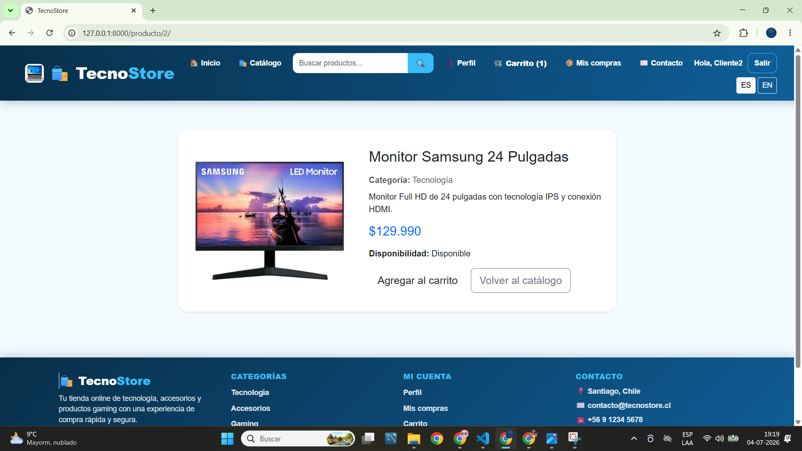
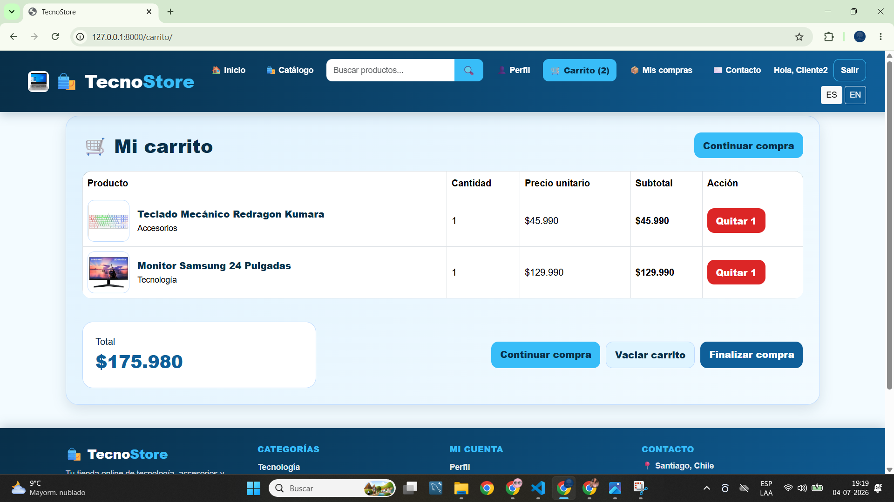
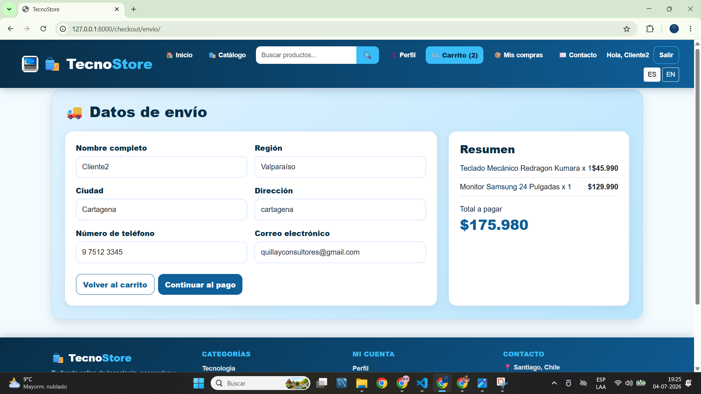
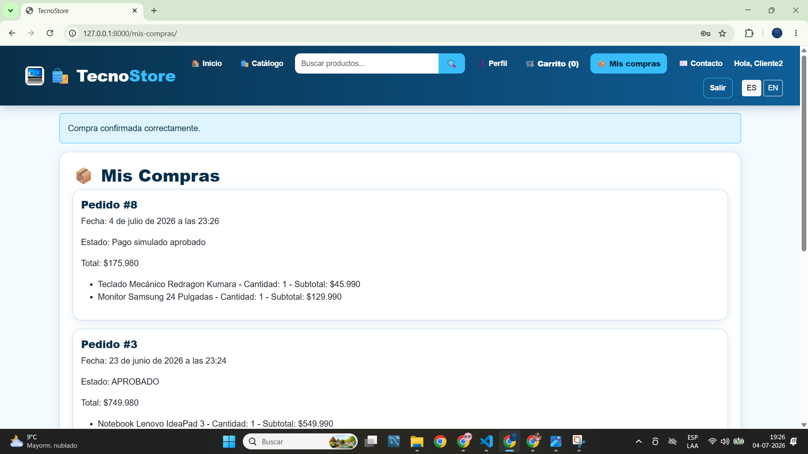
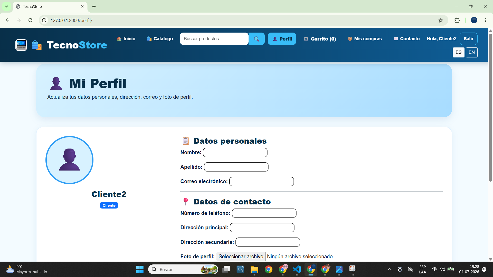
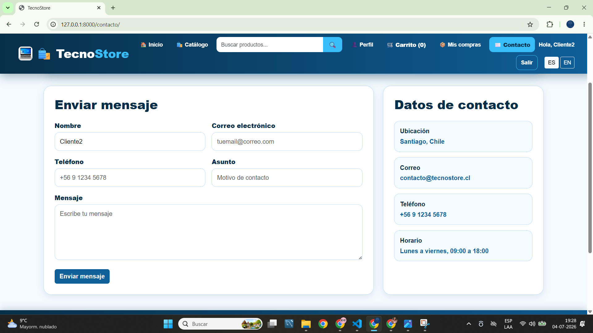

# 🛒 TecnoStore

**Versión 1.0**  
**Julio 2026**

TecnoStore es una aplicación web de comercio electrónico desarrollada con **Django** como proyecto académico para el módulo de Desarrollo Web.

El sistema permite gestionar un catálogo de productos tecnológicos, administrar un carrito de compras, realizar un proceso completo de compra mediante una **API REST de pago simulado**, mantener perfiles de usuario y registrar el historial de compras.

---

# 📑 Índice

- Descripción
- Tecnologías utilizadas
- Dependencias
- Estructura del proyecto
- Instalación
- Arquitectura
- Funcionalidades
- Roles del sistema
- Modelos implementados
- Flujo de compra
- API REST de simulación de pagos
- Internacionalización
- Seguridad
- Capturas del sistema
- Trabajo futuro
- Autora
- Licencia

---

# 📌 Descripción

TecnoStore implementa el flujo completo de una tienda virtual:

- Registro e inicio de sesión.
- Navegación por catálogo.
- Búsqueda de productos.
- Filtro por categorías.
- Carrito de compras.
- Checkout.
- Pago simulado.
- Historial de compras.
- Perfil editable.
- Formulario de contacto.
- Administración de productos y pedidos.

El objetivo del proyecto es aplicar los principales componentes del framework Django utilizando una arquitectura organizada y buenas prácticas de desarrollo.

---

# 🚀 Tecnologías utilizadas

- Python 3
- Django 6
- SQLite3
- HTML5
- CSS3
- Bootstrap 5
- JavaScript
- Pillow
- Requests

---

# 📦 Dependencias

```text
asgiref==3.11.1
certifi==2026.6.17
charset-normalizer==3.4.7
Django==6.0.6
idna==3.18
pillow==12.2.0
requests==2.34.2
sqlparse==0.5.5
tzdata==2026.2
urllib3==2.7.0
```

---

# 📁 Estructura del proyecto

```text
ecommerce_m7/
│
├── ecommerce_m7/
├── tienda/
├── media/
├── images/
├── scripts/
├── manage.py
├── db.sqlite3
├── requirements.txt
└── README.md
```

---

# ⚙️ Instalación

Clonar el repositorio.

```bash
git clone https://github.com/USUARIO/REPOSITORIO.git
```

Ingresar al proyecto.

```bash
cd ecommerce_m7
```

Crear un entorno virtual.

```bash
python -m venv .venv
```

Activarlo.

Windows

```bash
.venv\Scripts\activate
```

Instalar dependencias.

```bash
pip install -r requirements.txt
```

Aplicar migraciones.

```bash
python manage.py migrate
```

Crear un superusuario (opcional).

```bash
python manage.py createsuperuser
```

Ejecutar el servidor.

```bash
python manage.py runserver
```

Abrir en el navegador.

```
http://127.0.0.1:8000/
```

---

# 🏗️ Arquitectura

La aplicación utiliza el patrón **MTV (Model - Template - View)** propio de Django.

La organización del proyecto considera:

- Models
- Views
- Templates
- Forms
- URLs
- Static
- Media
- Internationalization (i18n)

---

# ✅ Funcionalidades implementadas

- Registro de usuarios.
- Inicio y cierre de sesión.
- Catálogo dinámico.
- Buscador de productos.
- Filtro por categorías.
- Ordenamiento por precio y nombre.
- Carrusel de productos destacados.
- Vista de detalle de producto.
- Carrito de compras.
- Eliminación de productos del carrito.
- Vaciado del carrito.
- Checkout de compra.
- Formulario de datos de envío.
- Pago simulado.
- API REST para simulación de pagos.
- Historial de compras.
- Perfil editable.
- Fotografía de perfil.
- Formulario de contacto.
- Panel administrativo de mensajes.
- Administración de productos.
- Internacionalización Español / Inglés.

---

# 👥 Roles del sistema

## Administrador

Puede:

- Crear productos.
- Editar productos.
- Eliminar productos.
- Revisar pedidos realizados.
- Consultar mensajes enviados desde contacto.
- Gestionar usuarios internos.

## Cliente

Puede:

- Registrarse.
- Iniciar sesión.
- Editar su perfil.
- Buscar productos.
- Filtrar productos.
- Agregar productos al carrito.
- Finalizar compras.
- Consultar su historial.
- Enviar mensajes mediante el formulario de contacto.

---

# 🗄️ Modelos implementados

El sistema utiliza los siguientes modelos:

- Categoria
- Producto
- PerfilCliente
- Carrito
- ItemCarrito
- Pedido
- DetallePedido
- MensajeContacto

---

# 🛍️ Flujo de compra

El proceso de compra implementado es el siguiente:

1. Inicio de sesión.
2. Navegación por el catálogo.
3. Selección de productos.
4. Agregar al carrito.
5. Revisión del carrito.
6. Ingreso de datos de envío.
7. Ingreso de datos de pago.
8. Simulación del pago mediante API REST.
9. Confirmación del pedido.
10. Registro del historial de compras.

---

# 💳 API REST de simulación de pagos

El proyecto implementa una API REST propia que simula el procesamiento de un pago.

Esta API fue desarrollada con fines académicos y **no realiza transacciones reales**.

### Endpoint

```
POST /api/pagos/simular/
```

### Solicitud

```json
{
    "monto": 175980,
    "metodo_pago": "Tarjeta",
    "cliente": "Cliente2"
}
```

### Respuesta exitosa

```json
{
    "estado": "APROBADO",
    "codigo_transaccion": "TXN-845321",
    "monto": 175980,
    "metodo_pago": "Tarjeta",
    "cliente": "Cliente2",
    "mensaje": "Pago simulado aprobado correctamente."
}
```

### Respuesta de error

```json
{
    "estado": "ERROR",
    "mensaje": "Descripción del error"
}
```

---

# 🌐 Internacionalización

El sistema incorpora soporte para múltiples idiomas mediante Django i18n.

Idiomas implementados:

- Español
- Inglés

Algunos textos dinámicos provenientes de la base de datos permanecen en el idioma original debido a la naturaleza del contenido almacenado.

---

# 🔒 Seguridad

La aplicación incorpora mecanismos de seguridad proporcionados por Django:

- Autenticación de usuarios.
- Protección CSRF en formularios.
- Restricción de vistas mediante `login_required`.
- Restricción de vistas administrativas mediante `user_passes_test`.
- Validación de formularios.
- Validación de datos antes del procesamiento de compras.

---

# 📷 Capturas del sistema

A continuación se muestran las principales funcionalidades implementadas.

## Página de inicio



---

## Catálogo



---

## Detalle del producto



---

## Carrito de compras



---

## Datos de envío



---

## Historial de compras



---

## Perfil de usuario



---

## Formulario de contacto



---

# 🚀 Trabajo futuro

Las siguientes mejoras pueden incorporarse en versiones posteriores:

- Integración con una pasarela de pago real.
- Generación de comprobantes descargables.
- Recuperación de contraseña.
- Dashboard administrativo con métricas.
- Gestión de inventario.
- Estados avanzados para pedidos.
- Optimización para dispositivos móviles.

---

# 👩 Autora

**Jenniffer Molina**

Proyecto desarrollado como evidencia académica para el módulo de Desarrollo Web utilizando Django.

---

# 📄 Licencia

Este proyecto fue desarrollado exclusivamente con fines académicos y no está destinado a uso comercial.